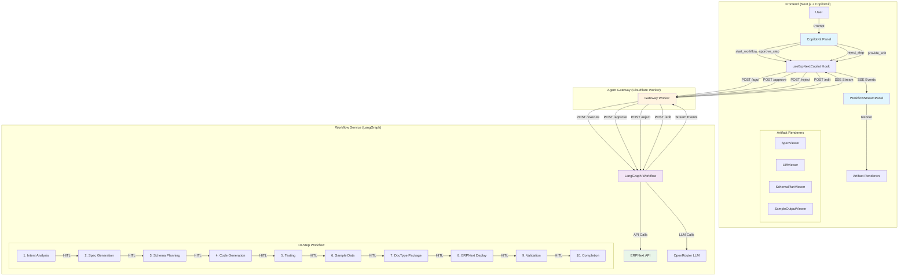
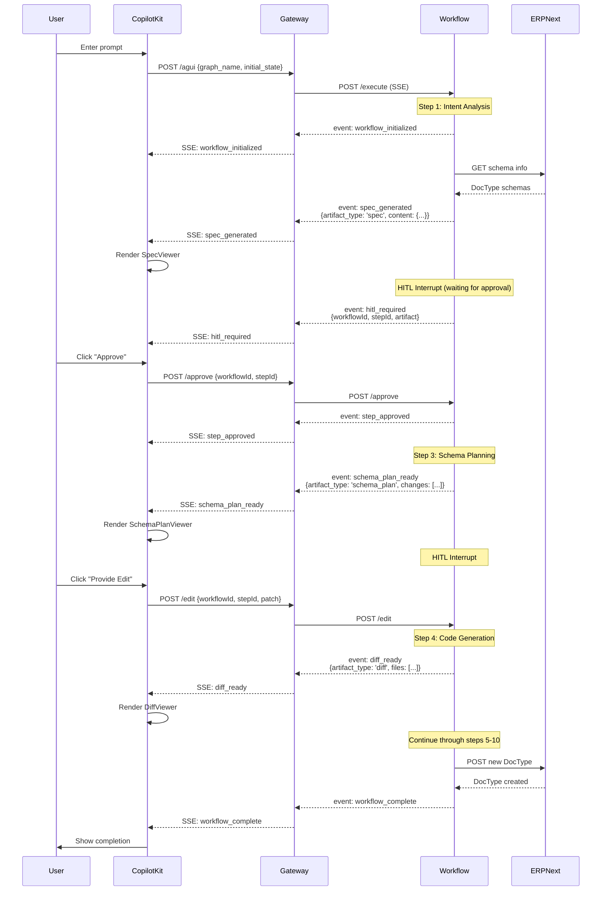
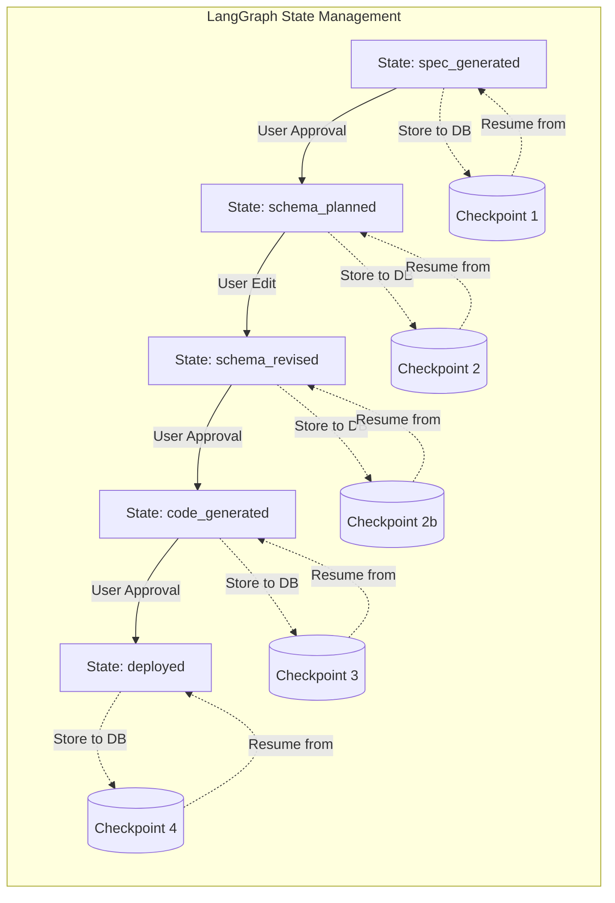
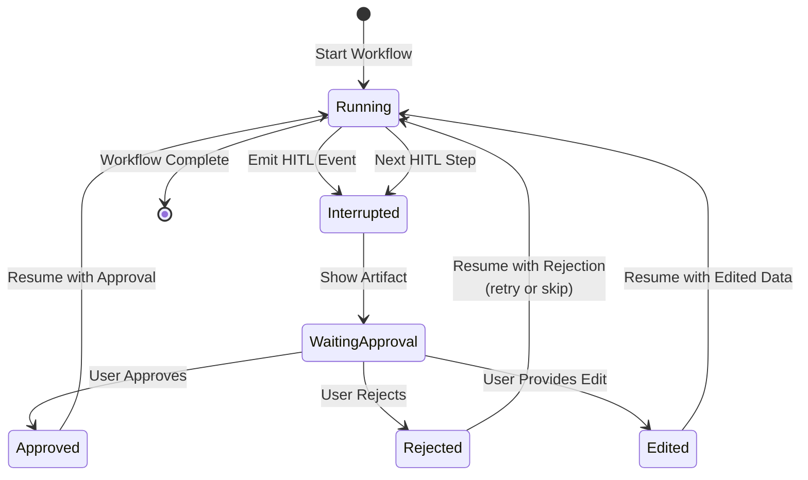
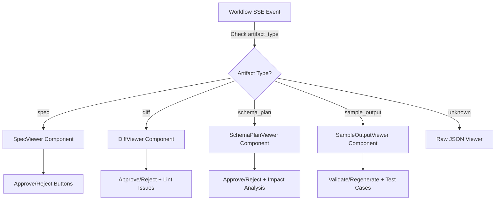

# ERPNext Copilot Architecture - Complete Flow

## System Architecture

## Event Flow Diagram

## State Checkpointing Flow

## HITL (Human-in-the-Loop) Interaction Flow

## Artifact Types and Renderers

## Key Components

### Frontend (Next.js + CopilotKit)
- **CopilotKit Panel**: Main UI for user interaction
- **useErpNextCopilot Hook**: Manages workflow state and SSE streaming
- **WorkflowStreamPanel**: Displays real-time workflow events
- **Artifact Renderers**: Domain-specific UI for each artifact type

### Agent Gateway (Cloudflare Worker)
- **POST /agui**: Initiates workflow and proxies SSE stream
- **POST /approve**: Forwards approval to workflow service
- **POST /reject**: Forwards rejection to workflow service
- **POST /edit**: Forwards edit/patch to workflow service
- **SSE Streaming**: Pipes events from workflow service to frontend

### Workflow Service (LangGraph)
- **LangGraph State Machine**: 10-step workflow with HITL interrupts
- **State Checkpointing**: Persists state to DB for resume capability
- **Artifact Generation**: Creates domain-specific artifacts at each step
- **ERPNext Integration**: API calls for schema inspection and deployment

### ERPNext API
- **Schema Inspection**: GET /api/resource/:doctype
- **DocType Creation**: POST /api/resource/DocType
- **Data Operations**: CRUD operations on custom DocTypes

## Event Types

### Workflow Events
- `workflow_initialized`: Workflow started
- `workflow_complete`: Workflow finished successfully
- `workflow_error`: Error occurred
- `workflow_aborted`: User cancelled workflow

### Step Events
- `spec_generated`: Design specification created (artifact)
- `schema_plan_ready`: Schema changes planned (artifact)
- `diff_ready`: Code diff generated (artifact)
- `sample_output_generated`: Sample data created (artifact)

### HITL Events
- `hitl_required`: Workflow paused for user input
- `step_approved`: User approved current step
- `step_rejected`: User rejected current step
- `edit_provided`: User provided edits to artifact

## Technology Stack

### Frontend
- **Next.js 14**: React framework with App Router
- **CopilotKit**: AI copilot framework
- **EventSource API**: SSE streaming client
- **Tailwind CSS**: Styling

### Backend
- **Cloudflare Workers**: Serverless edge runtime
- **LangGraph**: Workflow orchestration
- **Python FastAPI**: Workflow service (assumed)
- **PostgreSQL**: State checkpointing (LangGraph)

### External Services
- **OpenRouter**: LLM API
- **ERPNext**: Target deployment platform
